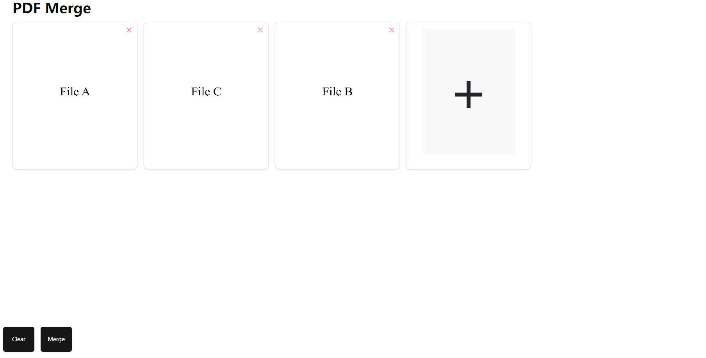

# Simple PDF Merger

 

This is a simple pdf merger using `pdf-merger-js/browser`, `pdfjs-dist` and `dnd-kit` with a single click.

This application is a totally frontend software. All the data is processed in the browser and no data is sent to any server.

Currently, only merge whole pdf file is supported. I hope to add support to specific pages in the future.

### Screenshot

